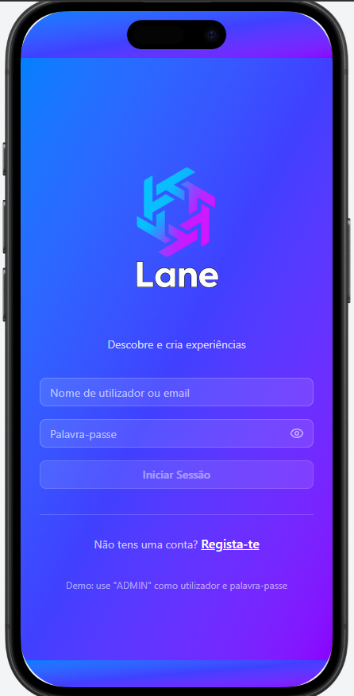
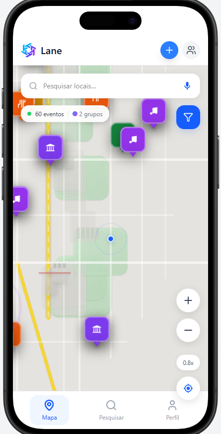
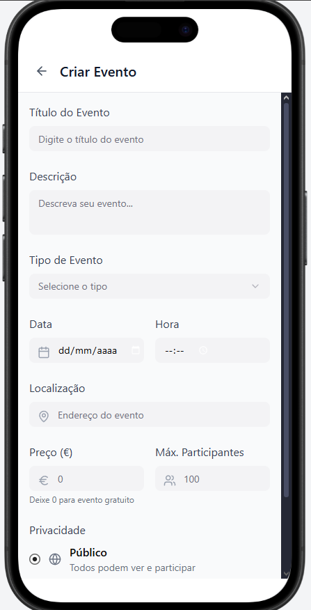

# Relatório da 2.ª Entrega
### Projeto de Desenvolvimento Móvel – **Lane**

---

**Universidade Europeia / IADE – Engenharia Informática**  
**Unidade Curricular:** Desenvolvimento Móvel (3.º semestre – 2025/2026)  
**Grupo 08**  
**Elementos:** Francisco Abecasis (20240120), Pedro António (20241273), Filomeno Sabino (20241963), Savio Casimira (20240896), Gianni Lopes (20240593)

**Figma:** [Protótipo Figma](https://www.figma.com/make/vswsO7IQaQb8flOO56HPa4/Lane?node-id=0-1&p=f&t=6yDjtiKhbPivRkoO-0&fullscreen=1)  
**ClickUp:** [Espaço ClickUp](https://app.clickup.com/90151662103/v/s/90156861389)  
**GitHub:** [Repositório do Projeto](https://github.com/MelhorNarrador/G08-Projeto-Mobile.git)  

---

---

## Palavras-chave
aplicações móveis, geolocalização, eventos, convites digitais, perfis verificados, mapas interativos

---

## 1. Introdução

A aplicação **Lane** visa facilitar a descoberta e partilha de eventos próximos, permitindo que os utilizadores possam **criar, explorar e participar** em eventos de forma simples e intuitiva.  
Na **primeira entrega**, foram definidos o conceito, público-alvo, arquitetura e mockups base.  
Nesta **segunda entrega**, o foco foi o **desenvolvimento do protótipo funcional mínimo**, incluindo **criação e visualização de eventos**, **login**, e **integração inicial com APIs externas**.

---

## 2. Enquadramento e Problema

A informação sobre eventos encontra-se dispersa entre múltiplas plataformas, dificultando o acesso a eventos locais e relevantes.  
A **Lane** centraliza este processo, promovendo a **proximidade social** e a **autenticidade dos eventos**, com um sistema de **perfis verificados**, **filtros por localização**, e **convites personalizados**.

---

## 3. Público-alvo

| Segmento | Características | Necessidades |
|-----------|-----------------|---------------|
| Jovens universitários | Frequentam festas e eventos culturais | Encontrar eventos próximos e seguros |
| Promotores e artistas | Criam eventos e desejam promover | Ferramentas simples de gestão e partilha |
| Cidadãos ativos | Procuram lazer e convívio | Ver eventos verificados e próximos |

---

## 4. Casos de Utilização do Objeto Core e personas

### Caso 1 – Criar um evento privado

1. O utilizador faz login.  
2. Seleciona “Criar evento”.  
3. Introduz nome, descrição, categoria, data e localização.  
4. Escolhe o tipo **Privado** e adiciona amigos convidados.  
5. Confirma e o evento é registado na base de dados.

**Resultado esperado:** Apenas os convidados podem visualizar e participar.

---

### Caso 2 – Explorar eventos próximos

1. O utilizador concede acesso à localização.  
2. A app apresenta um mapa com eventos próximos.  
3. O utilizador filtra por tipo e distância.  
4. Ao selecionar um evento, pode ver detalhes e navegar até lá.

**Resultado esperado:** O utilizador encontra eventos relevantes de forma rápida.

---

##Personas

---

## 5. Arquitetura e Tecnologias

### 5.1 Arquitetura
- **Camada Mobile:** Android (Kotlin + Jetpack Compose)  
- **Camada Backend:** Spring Boot (REST API)  
- **Base de Dados:** PostgreSQL  
- **Integrações Externas:** Google Maps API  

**Descrição:**  
A arquitetura segue o modelo **Cliente–Servidor**, com comunicação via **API RESTful**.  
O backend gere autenticação, eventos e utilizadores, enquanto o frontend apresenta os dados em tempo real através de endpoints.
Uma decisão de arquitetura chave foi a gestão das relações sociais. A regra de negócio define 'amizade' como um seguimento mútuo. Para evitar redundância de dados e problemas de integridade, a tabela friends (Tabela que iria gerir o estado de amizade na primeira versão da BD) foi eliminada. A tabela followers é agora a única fonte da verdade, e o estado de 'amizade' é um dado calculado dinamicamente pelo backend (API) sempre que a app o solicita.

---

### 5.2 Tecnologias e Ferramentas

| Categoria | Tecnologia | Função |
|------------|-------------|--------|
| Mobile | Kotlin, Jetpack Compose | Interface e lógica de apresentação |
| Backend | Java/Spring Boot | Gestão de rotas e API REST |
| Base de Dados | PostgreSQL | Armazenamento de utilizadores e eventos |
| APIs | Google Maps SDK | Localização e rotas |
| Gestão | GitHub, ClickUp, Discord | Controlo de versões e comunicação |
| Design | Figma | Mockups e UI/UX |

---

## 6. Requisitos Funcionais e Não Funcionais

### Requisitos Funcionais
- Login e registo de utilizadores  
- Criação e edição de eventos  
- Pesquisa e filtragem de eventos por tipo e distância  
- Sistema de convites privados  
- Perfis verificados com selo  

### Requisitos Não Funcionais
- Interface intuitiva e responsiva  
- Segurança de Autenticação via Spring Security 
- Conformidade com o RGPD
- Chat privado

### 6.2 Requisitos Não Funcionais (Análise de Recursos)
A natureza da "Lane" como uma app baseada em mapas e dados em tempo real implica um consumo de recursos significativo:
* **No Cliente (App):** O consumo de **Bateria** e **GPS** é o ponto mais crítico, devido à necessidade de renderizar o Google Maps SDK e obter a localização do utilizador para calcular distâncias. O consumo de **Dados Móveis** também é relevante, para descarregar os "azulejos" do mapa e as listas de eventos da API.
* **No Servidor (Custos):** A app irá incorrer em custos de *hosting* (para o *backend* Spring Boot e a BD PostgreSQL) e custos de **API da Google Maps Platform**. Especificamente, as chamadas de **Geocoding** (para converter endereços de eventos em coordenadas) e **Directions** (para calcular rotas) são feitas pelo *backend* por razões de segurança, e serão debitadas (embora cobertas, numa fase inicial, pelo crédito mensal de 258€ da Google).

---

## 7. Mockups e Interfaces

Incluem-se abaixo os principais ecrãs da versão alfa:

  
  
  

[Ver protótipo no Figma](https://www.figma.com/make/vswsO7IQaQb8flOO56HPa4/Lane?node-id=0-1&p=f&t=6yDjtiKhbPivRkoO-0&fullscreen=1)

---

## 8. Planeamento e Execução

O projeto foi organizado no ClickUp e Discord.  
Nesta fase, foram concluídas as seguintes tarefas:

- Integração entre frontend e backend  
- Ligação da base de dados PostgreSQL  
- Criação de eventos  
- Implementação do login e registo de utilizadores
- Planeamento da verificação de perfis

**Planeado para a 3ª entrega:**
- Implementação de tokens JWT
- Finalização de todos os ecrãs da app 
- Integração completa do mapa

[Gráfico de Gantt]

---

## 9. Diagrama de Classes (Modelo Conceptual)

**Descrição:** O diagrama de classes reflete as principais entidades (Utilizador, Evento, Convite, Seguidor) e as suas relações. Uma decisão de arquitetura chave foi a gestão das relações sociais: a regra de negócio define 'amizade' como um seguimento mútuo. Para evitar redundância de dados, a tabela `friends` foi eliminada. A tabela `followers` é agora a única fonte da verdade, e o estado de 'amizade' é um dado calculado dinamicamente pelo *backend* (API).

---

## 10. Dicionário de Dados (Guia de Dados)

Esta secção detalha a estrutura física (Modelo Físico) das tabelas implementadas na base de dados PostgreSQL, cumprindo os requisitos de um "Dicionário de Dados".

| Tabela | Campos Principais | Descrição |
|---|---|---|
| `user_details` | `account_id` (PK), `account_username`, `account_email`, `account_password_hash`, `account_dob`, `account_gender` | Armazena os dados do utilizador, incluindo `UNIQUE` constraints para username/email e `CHECK` para género. |
| `events` | `event_id` (PK), `event_title`, `event_creator_id` (FK), `event_category_id` (FK), `max_participants`, `event_latitude` | Armazena todos os eventos. Inclui o limite de participantes e as coordenadas de GPS. |
| `filters` | `filters_id` (PK), `filters_name` | Tabela de "lookup" para as categorias dos eventos (ex: "Música", "Cultural"). |
| `followers` | `follow_id` (PK), `follower_id` (FK), `following_id` (FK) | **Tabela central da lógica social.** Armazena a relação "seguir". Usada para *calcular* amizades (seguimento mútuo). |
| `event_participants` | `participant_id` (PK), `event_id` (FK), `user_id` (FK) | Tabela de junção que regista quem "aderiu" a um evento (o botão "Participar"). |
| `invitations` | `invitations_id` (PK), `event_id` (FK), `sender_id`, `receiver_id`, `status` | Gere os convites para eventos privados, com um `status` (`pending`, `accepted`, `rejected`). |

---

## 11. Documentação REST

A tabela seguinte resume os principais *endpoints* da API REST implementados no *backend* (Spring Boot) para suportar as funcionalidades do MVP (Protótipo Funcional Mínimo).

| Verbo | Endpoint | DTO (Request Body) | Resposta | Função |
|---|---|---|---|---|
| `POST` | `/api/users/users` | `RegisterRequestDTO` | `User` | **Registar** um novo utilizador. |
| `POST` | `/api/users/login` | `LoginRequestDTO` | `LoginResponseDTO` | **Autenticar** um utilizador e devolver um token. |
| `GET` | `/api/events/events` | - | `List<Event>` | Obter a lista de todos os eventos. |
| `POST`| `/api/events/create/events` | `CreateEventDTO` | `Event` | **Criar** um novo evento. |
| `GET` | `/api/filters/get/filters` | - | `List<Filters>` | Obter as categorias para o *dropdown*. |

---

## 12. Conclusão

O desenvolvimento da Lane encontra-se numa fase sólida, com o MVP funcional e integração entre os principais módulos. A integração total das três camadas (Frontend Android/Compose, Backend Spring Boot, e Base de Dados PostgreSQL) foi um marco complexo, mas está agora funcional.

Os fluxos de **Registo de Utilizador** (com *hashing* de password via `BCrypt`) e **Login de Utilizador** (com gestão de sessão) estão a funcionar e ligados ao *backend*. A app consegue agora criar e (em breve) visualizar eventos (`POST /api/events/create/events`), e ir buscar dados dinâmicos da API, como as categorias de filtros (`GET /api/filters/get/filters`).

Os próximos passos (3ª entrega) focar-se-ão em implementar a segurança total com *tokens JWT*, finalizar a lógica de *geocoding* no *backend* e desenvolver as restantes funcionalidades sociais, como o ecrã de perfil e a interação com o mapa.

## 13. Bibliografia e Referências

* **Google.** [*Documentação Oficial do Jetpack Compose.*](https://developer.android.com/jetpack/compose)
* **Google.** [*Google Maps SDK for Android Documentation.*](https://developers.google.com/maps/documentation/android-sdk/)
* **Spring.** [*Spring Boot Documentation.*](https://spring.io/projects/spring-boot)
* **Spring.** [*Spring Security - Password Storage (BCrypt).*](https://docs.spring.io/spring-security/reference/features/authentication/password-storage.html)
* **PostgreSQL.** [*Documentação Oficial do PostgreSQL.*](https://www.postgresql.org/docs/)
* **Square.** [*Retrofit: A type-safe HTTP client for Android and Java.*](https://square.github.io/retrofit/)
---
