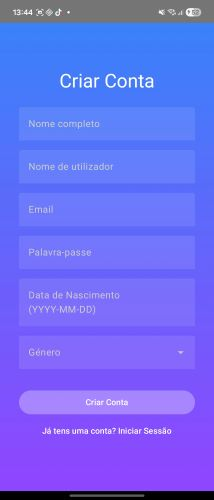
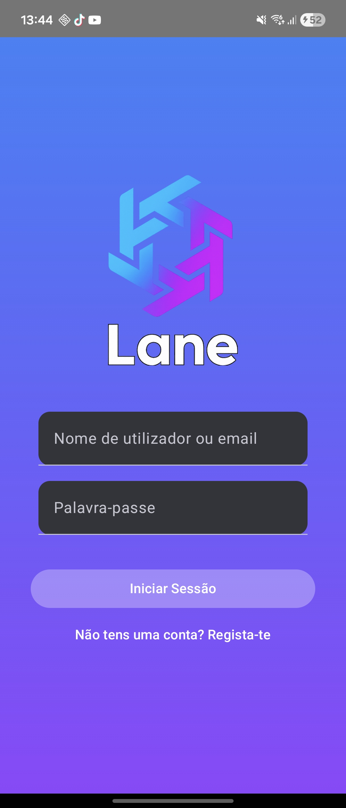
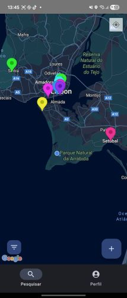
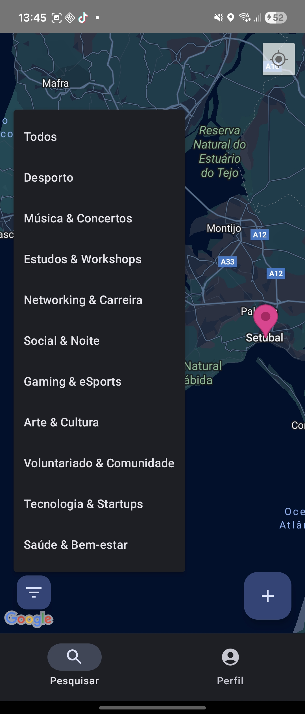
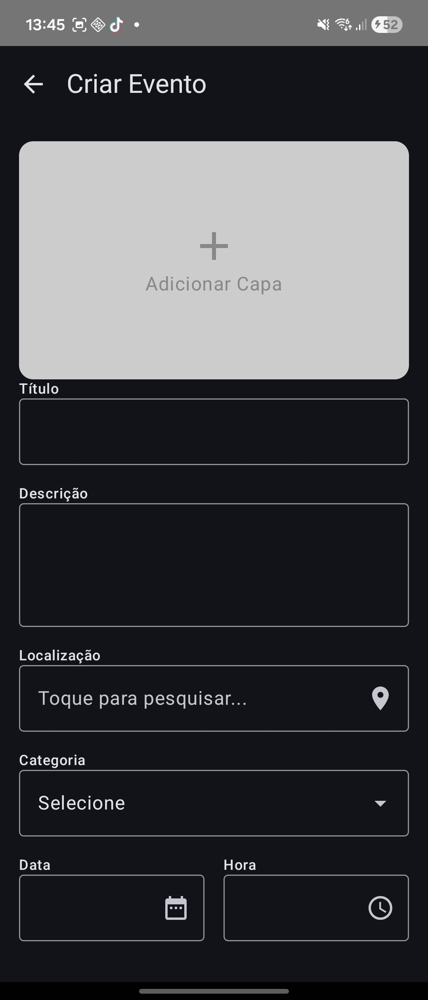
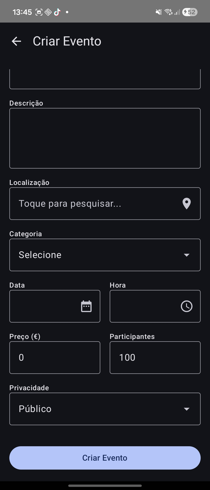
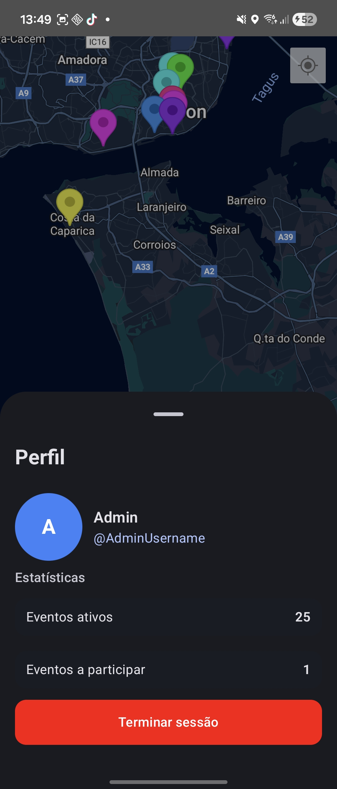
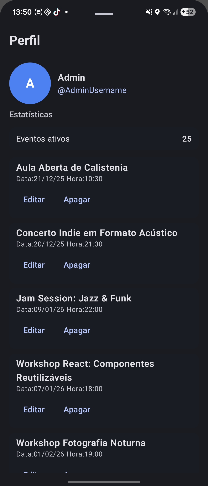
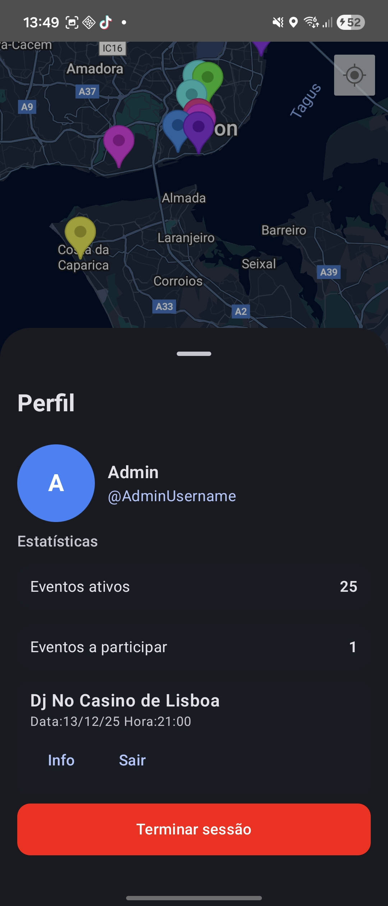
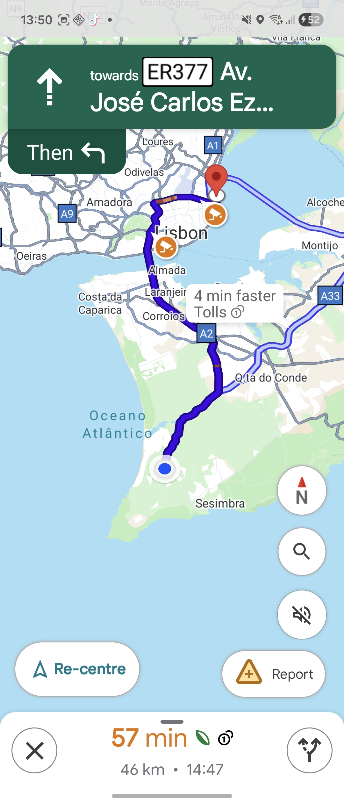

# Manual De Utilizador

---

A **Lane** é uma aplicação móvel para descobrir e criar eventos com base na sua localização.  
O objetivo é simples: **ver o que está a acontecer perto de si**, **encontrar eventos por categoria** e **criar/gerir os seus próprios eventos**.

---

## Índice

1. [Vista geral](#vista-geral)
2. [Requisitos](#requisitos)  
3. [Criar conta](#criar-conta)
4. [Iniciar sessão](#iniciar-sessão)
5. [Navegação principal](#navegação-principal)  
6. [Explorar eventos no mapa](#explorar-eventos-no-mapa)  
7. [Filtrar por categorias](#filtrar-por-categorias)  
8. [Criar um evento](#criar-um-evento)  
9. [Perfil](#perfil)  
10. [Gerir eventos](#gerir-eventos-admin)
11. [Eventos a participar](#eventos-a-participar)  
12. [Rotas até ao evento](#rotas-até-ao-evento)  
13. [Boas práticas e erros comuns](#boas-práticas-e-erros-comuns)  
14. [Resolução de problemas](#resolução-de-problemas)  

---

## Vista geral

A Lane organiza eventos em **pins no mapa**. Cada pins representa um evento numa localização.  
Dentro da aplicação consegue:

 **Filtrar** por categorias (ex.: Desporto, Música, Workshops, Social & Noite, etc.).
- **Criar eventos** (título, descrição, localização, categoria, data/hora, preço e limite de participantes).
- **Gerir eventos** (editar/apagar).
- **Ver eventos a participar** e sair desses eventos.
- **Abrir rotas** para navegar até ao local do evento.

---

## Requisitos

- Smartphone com ligação à internet.
- **Permissão de localização** (recomendada mas não obrigatório).
- Conta Lane.

---

## Criar conta

1. Na página de login, clique em **“Não tens uma conta? Regista-te”**.
2. Preencha os campos:
   - **Nome completo**
   - **Nome de utilizador**
   - **Email**
   - **Palavra-passe**
   - **Data de nascimento**
   - **Género**
3. Clique em **“Criar Conta”** para concluir.

**Ecrã de referência:**  

---

## Iniciar sessão

1. Abra a app Lane ou depois de um registo com sucesso.
2. Introduza:
   - **Nome de utilizador ou email**
   - **Palavra-passe**
3. Clique em **“Iniciar Sessão”**.

**Ecrã de referência:**  

---

## Navegação principal

A navegação principal é feita pela barra inferior:

- **Perfil**: abre o seu perfil, estatísticas e ações relacionadas com eventos.
- **Ecrã Mapa**: Utilizando gestos, navegue o mapa para encontrar eventos, clique num pin para ver detalhes.

**Ecrã de referência:**  

---

## Explorar eventos no mapa

No **ecrã principal**, vê o mapa com vários marcadores coloridos:

- Cada marcador representa um evento.
- Cada cor representa uma categoria (Dicionario de categorias do ponto seguinte)
- Pode fazer zoom e mover o mapa para explorar zonas diferentes.

Dicas rápidas:
- **Zoom in** para separar marcadores próximos e ver melhor as localizações.
- **Mova o mapa** para procurar eventos noutras áreas.
- Se tiver a localização ativa, os resultados ficam mais úteis.

**Ecrã de referência:**  

---

## Filtrar por categorias

Para filtrar os eventos no mapa, use o botão de **filtros** (ícone no canto inferior esquerdo).

Categorias disponíveis:
- Todos - Mostra todas as categorias
- Desporto - Laranja
- Música & Concertos - Violeta
- Estudos & Workshops - Azul Celeste
- Networking & Carreira - Ciano
- Social & Noite - Rosa
- Gaming & eSports - Verde
- Arte & Cultura - Magenta
- Voluntariado & Comunidade - Amarelo
- Tecnologia & Startups - Azul
- Saúde & Bem-estar - Vermelho

1. Abra o menu de filtros.
2. Selecione uma categoria.
3. O mapa passa a mostrar eventos dessa categoria.

**Ecrã de referência:**  

---

## Criar um evento

Para criar um evento, use o botão **“+”** no canto inferior direito do ecrã principal.

Campos disponíveis na criação:
- **Capa** (imagem do evento)
- **Título**
- **Descrição**
- **Localização** (pesquisa e seleção)
- **Categoria**
- **Data**
- **Hora**
- **Preço (€)**
- **Participantes** (limite)
- **Privacidade**

Passos:
1. Clique em **“+”** no mapa.
2. (Opcional) Clique em **Adicionar Capa** para selecionar uma imagem.
3. Preencha os campos obrigatórios.
4. Defina o preço e limite conforme necessário (Deixe o preço a 0 se for gratuito).
5. clique em **“Criar Evento”**.

**Ecrãs de referência:**  
  

---

## Perfil

No ecrã **Perfil** consegue ver:

- Avatar e identificação do utilizador.
- **Estatísticas**, como:
  - **Eventos ativos**
  - **Eventos a participar**
- Botão para **Terminar sessão** (logout).

**Ecrã de referência:**  

---

## Gerir eventos

O Perfil mostra uma lista de eventos ativos criados/geridos por si, com ações:

- **Editar**: altera os dados do evento.
- **Apagar**: remove o evento.

> Atenção: Ao clicar para apagar um evento o mesmo sera removido, esta é uma ação irreversível

**Ecrã de referência:**  

---

## Eventos a participar

Quando está inscrito num, ou mais, eventos, no Perfil a secção de participação mostra o numero de eventos em que está inscrito, ao expandir pode selecionar um eventos e clicar em:

- **Info**: abre informação/detalhes do evento.
- **Sair**: remove a sua participação.

**Ecrã de referência:**  

## Rotas até ao evento

A Lane pode encaminha-lo para navegação até ao local do evento (via app de mapas do telemóvel).  
O fluxo é:

1. Abrir detalhes do evento.
2. Clicar num dos três botões no inferior da pagina (A pé, de carro, de transportes públicos).
3. O telemóvel abre a navegação com o percurso sugerido.

**Ecrã de referência (exemplo de rota):**  

---

## Boas práticas

- **Data e hora**: confirme sempre antes de publicar (evite eventos “no passado”).
- **Localização**: escolha um ponto exato (não “Lisboa” genérico se for num sítio específico).
- **Participantes**: defina um limite realista (evite overbooking).
- **Preço**: se o evento for gratuito, mantenha **0€** para mostrar gratuito.

---

## Resolução de problemas

**Não aparecem eventos no mapa**
- Confirme a ligação à internet.
- Remova filtros (selecione **Todos**).
- Faça zoom out e procure noutra zona.

**Não consigo criar conta**
- Verifique se o email já está registado.
- Tente outro nome de utilizador.

**Não consigo iniciar sessão**
- Confirme se está a usar o username/email correto.
- Verifique maiúsculas/minúsculas na palavra-passe.

**Rotas não abrem**
- Confirme que tem a app Google Maps instalada.
- Dê permissão de localização à app.

---
