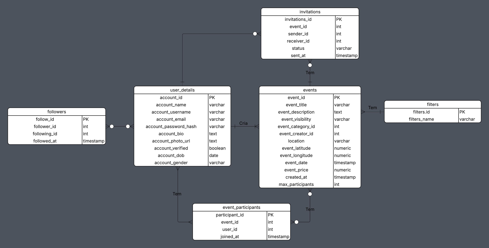

# Relatório Técnico da Base de Dados  
**Projeto:** Lane – Plataforma de Descoberta e Participação em Eventos  
**Curso:** Engenharia Informática  
**Turma:** D02
**Unidade Curricular:** Base De Dados
**Ano Letivo:** 2024 / 2025

---

## 1. Introdução
A aplicação **Lane** é uma plataforma social focada na descoberta, criação e participação em eventos. O utilizador pode:

- Criar eventos;
- Juntar-se como participante a eventos existentes.
- Visualizar eventos no mundo todo

As ferramentas utilizadas para o desenvolvimento e gestão desta base de dados foram o **PostgreSQL** e o gestor de base de dados **pgAdmin** com o objetivo de garantir:

- **Integridade** dos dados
- **Escalabilidade e performance** (através de índices nas colunas mais utilizadas);
- **Coerência com o backend** da API

O ficheiro `Create.sql` contém o script de criação completo da base de dados (tabelas, constraints e índices), servindo de referência principal para este relatório.

---

## 2. Diagrama Entidade-Relação (Dicionario de dados) 

A base de dados é organizada em torno de 6 entidades principais:

- `user_details` – Utilizadores da plataforma;
- `filters` – Categorias/tipos de evento;
- `events` – Eventos criados pelos utilizadores;
- `followers` – Relações “seguir” entre utilizadores;
- `invitations` – Convites enviados para eventos;
- `event_participants` – Participações dos utilizadores em eventos.

### 2.1. `user_details` — `events`  (Cria / É criado por)

- **Chave estrangeira:** `events.event_creator_id` → `user_details.account_id`
- **Cardinalidade:**
  - Um **utilizador** pode **criar 0..N eventos**.
  - Cada **evento** é criado por **exatamente 1 utilizador**.
- **Interpretação:**  
  Sempre que um evento é registado, o campo `event_creator_id` guarda o `account_id` do utilizador que o criou.

  ### 2.2. `filters` — `events`  (Classifica / Pertence a)

- **Chave estrangeira:** `events.event_category_id` → `filters.filters_id`
- **Cardinalidade:**
  - Um **filtro/categoria** pode estar associado a **0..N eventos**.
  - Cada **evento** pertence a **no máximo 1 categoria**.
- **Interpretação:**  
  As linhas de `filters` representam categorias (ex.: “Desporto”, “Música”, “Gaming & eSports”).  
  A cada evento é associada uma categoria através de `event_category_id`, permitindo filtrar e agrupar eventos por tipo.

### 2.3. `user_details` — `followers`  (Segue / É seguido)

Relação auto-referenciada entre utilizadores, implementada pela tabela `followers`.

- **Chaves estrangeiras:**
  - `followers.follower_id` → `user_details.account_id`
  - `followers.following_id` → `user_details.account_id`
- **Cardinalidade:**
  - Um **utilizador** pode **seguir 0..N outros utilizadores**.
  - Um **utilizador** pode ser **seguido por 0..N utilizadores**.
- **Interpretação:**  
  Cada registo em `followers` representa uma relação “A segue B”.  
  A combinação `(follower_id, following_id)` deve ser única para evitar follows duplicados, e há um `CHECK` para impedir que alguém se siga a si próprio.

### 2.4. `user_details` — `event_participants` — `events`  (Participa / Tem participantes)

Relação N-N entre utilizadores e eventos, materializada pela tabela `event_participants`.

- **Chaves estrangeiras:**
  - `event_participants.user_id` → `user_details.account_id`
  - `event_participants.event_id` → `events.event_id`
- **Cardinalidade lógica:**
  - Um **utilizador** pode **participar em 0..N eventos**.
  - Um **evento** pode **ter 0..N participantes**.
- **Cardinalidade física por lado:**
  - Um registo em `event_participants` referencia **1 utilizador** e **1 evento**.
- **Interpretação:**  
  Sempre que um utilizador se inscreve num evento, é criado um registo em `event_participants`.  
  A combinação `(event_id, user_id)` deve é única, garantindo que um utilizador não entra mais do que uma vez no mesmo evento.

### 2.5. `events` — `invitations` — `user_details`  (Tem convites / Envia / Recebe)

A tabela `invitations` liga eventos a dois utilizadores: o que envia e o que recebe o convite.

- **Chaves estrangeiras:**
  - `invitations.event_id` → `events.event_id`
  - `invitations.sender_id` → `user_details.account_id`
  - `invitations.receiver_id` → `user_details.account_id`
- **Cardinalidade:**
  - Um **evento** pode ter **0..N convites** associados.
  - Um **utilizador** pode **enviar 0..N convites**.
  - Um **utilizador** pode **receber 0..N convites**.
  - Cada **convite** refere-se a **1 evento**, **1 emissor** e **1 recetor**.
- **Interpretação:**  
  Cada linha em `invitations` representa “o utilizador X convidou o utilizador Y para o evento Z”.  
  O campo `status` (`pending`, `accepted`, `rejected`) indica o estado atual desse convite.

### 2.6. Resumo Global das Relações

- **Utilizador cria eventos:** `user_details` 1 — N `events`
- **Evento pertence a uma categoria:** `filters` 1 — N `events`
- **Utilizadores seguem utilizadores:** `user_details` N — N `user_details` via `followers`
- **Utilizadores participam em eventos:** `user_details` N — N `events` via `event_participants`
- **Convites envolvem eventos e dois utilizadores:** `events` 1 — N `invitations` e `user_details` 1 — N `invitations` (como `sender` e `receiver`)

Esta descrição cobre todas as relações presentes no diagrama ER apresentado.

---

## 3. Diagrama ER

---

## 4. Guia de Dados

Abaixo está a descrição detalhada de cada tabela na sua forma final.

### 4.1. Tabela: `user_details`

**Propósito:** Tabela central que armazena a informação de cada conta de utilizador.

| Coluna | Tipo | PK/FK/Constraint | Descrição |
|---|---|---|---|
| `account_id` | `SERIAL` | `PK` | Identificador único e auto-incrementado. |
| `account_name` | `VARCHAR(100)` | `NOT NULL` | Nome real do utilizador. |
| `account_username` | `VARCHAR(50)` | `NOT NULL`, `UNIQUE` | Nome de utilizador público. `UNIQUE` impede registos duplicados. |
| `account_email` | `VARCHAR(120)` | `NOT NULL`, `UNIQUE` | Email de login. `UNIQUE` impede registos duplicados. |
| `account_password_hash` | `VARCHAR(255)` | `NOT NULL` | A password *hashada* (ex: bcrypt). A password original nunca é guardada. |
| `account_bio` | `TEXT` | | Biografia opcional do perfil. |
| `account_photo_url` | `TEXT` | | URL para a imagem de perfil. |
| `account_verified` | `BOOLEAN` | `DEFAULT false` | Estado de verificação da conta. |
| `account_dob` | `DATE` | |Data de Nascimento. Usada para calcular a idade dinamicamente. |
| `account_gender` | `VARCHAR(30)` | `CHECK` | `CHECK` constraint garante a integridade dos dados do *dropdown menu*. |

### 4.2. Tabela: `filters`

**Propósito:** Armazena as categorias (Tipos de Evento) para o *dropdown menu* de criação de eventos.

| Coluna | Tipo | PK/FK/Constraint | Descrição |
| --- | --- | --- | --- |
| `filters_id` | `SERIAL` | `PK` | Identificador único da categoria. |
| `filters_name` | `VARCHAR(50)` | `NOT NULL`, `UNIQUE` | O nome da categoria (ex: "Desporto", "Música & Concertos", "Estudos & Workshops"). |

### 4.3. Tabela: `events`

**Propósito:** Armazena a informação de todos os eventos criados na plataforma.

| Coluna | Tipo | PK/FK/Constraint | Descrição |
| --- | --- | --- | --- |
| `event_id` | `SERIAL` | `PK` | Identificador único do evento. |
| `event_title` | `VARCHAR(150)` | `NOT NULL` | Título do evento. |
| `event_description` | `TEXT` | | Descrição longa do evento. |
| `event_visibility` | `VARCHAR(20)` | `NOT NULL`, `CHECK` | Visibilidade ('public', 'private'). |
| `event_category_id` | `INT` | `FK` (filters) | Liga ao `filters_id`. É o "Tipo de Evento". |
| `event_creator_id` | `INT` | `FK` (user\_details) | O utilizador que criou o evento. |
| `location` | `VARCHAR(255)` | | O endereço textual. |
| `event_latitude` | `NUMERIC(9,6)` | | Coordenada para o Google Maps. |
| `event_longitude` | `NUMERIC(9,6)` | | Coordenada para o Google Maps. |
| `event_date` | `TIMESTAMP` | `NOT NULL` | A data e hora exata do evento. |
| `event_price` | `NUMERIC(10,2)` | `DEFAULT 0` | O preço do evento. |
| `max_participants` | `INT` | `NOT NULL` | Limite de participantes. |
| `created_at` | `TIMESTAMP` | `DEFAULT NOW()` | Data de criação do registo. |
| `event_image` | `TEXT` | `–` | Imagem associada ao evento (Base64) |

### 4.4. Tabela: `followers`

**Propósito:** Tabela de junção que armazena a relação "seguir".

| Coluna | Tipo | PK/FK/Constraint | Descrição |
| --- | --- | --- | --- |
| `follow_id` | `SERIAL` | `PK` | ID da relação. |
| `follower_id` | `INT` | `NOT NULL`, `FK` (user) | O utilizador que *segue*. |
| `following_id` | `INT` | `NOT NULL`, `FK` (user) | O utilizador que *é seguido*. |
| `(follower_id, following_id)` | | `UNIQUE`, `CHECK` | Garante que A só pode seguir B uma vez. Garante que o user não se pode seguir a si mesmo|

### 4.5. Tabela: `event_participants`

**Propósito:** Tabela de junção que armazena quem "aderiu" a um evento.

| Coluna | Tipo | PK/FK/Constraint | Descrição |
| --- | --- | --- | --- |
| `participant_id` | `SERIAL` | `PK` | ID da participação. |
| `event_id` | `INT` | `NOT NULL`, `FK` (events) | O evento ao qual aderiu. |
| `user_id` | `INT` | `NOT NULL`, `FK` (user) | O utilizador que aderiu. |
| `(event_id, user_id)` | | `UNIQUE` | Garante que um utilizador não pode aderir duas vezes. |

### 4.6. Tabela: `invitations`

**Propósito:** Tabela de junção que gere convites para eventos *privados* ou por *convite*.

| Coluna | Tipo | PK/FK/Constraint | Descrição |
| --- | --- | --- | --- |
| `invitations_id` | `SERIAL` | `PK` | ID do convite. |
| `event_id` | `INT` | `NOT NULL`, `FK` (events) | O evento para o qual se convida. |
| `sender_id` | `INT` | `NOT NULL`, `FK` (user) | O utilizador que *envia* o convite. |
| `receiver_id` | `INT` | `NOT NULL`, `FK` (user) | O utilizador que *recebe* o convite. |
| `status` | `VARCHAR(20)` | `CHECK` | Estado: 'pending', 'accepted', 'rejected'. |
| `(event_id, sender_id, receiver_id)` | | `UNIQUE` | Impede o envio de convites duplicados. |

## 4.7. Otimização e Performance (Índices)

A performance é crítica para uma aplicação móvel. Uma query lenta no *backend* resulta numa UI "congelada". Para mitigar isto, foram criados **índices*.

  * **Justificação:** Operações como carregar um evento e o seu criador, ou encontrar todos os seguidores de um utilizador, exigem `JOIN`s ou `WHERE`s nessas colunas.
  * **Impacto:** Um `INDEX` transforma uma operação de "Table Scan" (ler a tabela inteira, muito lento) numa operação "Index Scan" (ir direto ao dado, muito rápido), garantindo que a app se mantém rápida.

**Índices Criados:**
* `idx_events_creator_id ON public.events(event_creator_id)`
* `idx_events_category_id ON public.events(event_category_id)`
* `idx_events_location ON public.events(event_latitude, event_longitude)`
* `idx_followers_follower_id ON public.followers(follower_id)`
* `idx_followers_following_id ON public.followers(following_id)`
* `idx_invitations_event_id ON public.invitations(event_id)`
* `idx_invitations_sender_id ON public.invitations(sender_id)`
* `idx_invitations_receiver_id ON public.invitations(receiver_id)`
* `idx_event_participants_event_id ON public.event_participants(event_id)`
* `idx_event_participants_user_id ON public.event_participants(user_id)`

