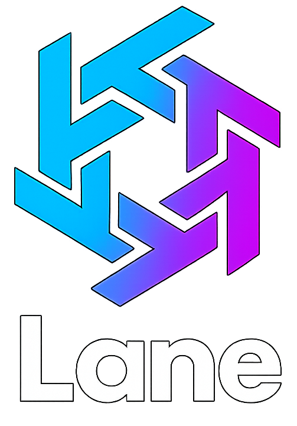

# Lane – Aplicação de Localização de Eventos

**Universidade Europeia / IADE – Engenharia Informática**  
**Projeto Mobile – 3º semestre (2025/2026)**  
**Grupo XX**  
**Elementos do Grupo**: Francisco Abecasis (20240120), Pedro António (20241273), Filomeno Sabino (20241963), Savio Casimira (20240896)

**GitHub Repo**: <link>  
**Figma**: [Protótipo no Figma](https://www.figma.com/make/vswsO7IQaQb8flOO56HPa4/Event-Location-Mobile-App?node-id=0-1&t=QazlaUYdgDNLVjF1-1)  
**ClickUp**: [Espaço ClickUp](https://app.clickup.com/90151662103/v/s/90156861389)  
**Discord**: [Servidor Lane](https://discord.gg/N9EJm2re)

---

---

## Palavras-chave
aplicações móveis, geolocalização, descoberta de eventos, convites digitais, perfis verificados, redes sociais, mapas interativos

---

## 1. Descrição & Problema
A descoberta de eventos locais encontra-se atualmente dispersa entre diferentes plataformas, dificultando a centralização da informação.  
A **Lane** propõe-se a resolver este problema, oferecendo uma aplicação mobile onde os utilizadores podem **criar, partilhar e descobrir eventos**.  
Além disso, a aplicação diferencia-se pela possibilidade de eventos **públicos, privados e por convite**, pela implementação de **perfis verificados** e pela integração com **mapas interativos** que guiam os utilizadores até ao evento.

---

## 2. Objetivos & Motivação
### Objetivos
- Desenvolver uma aplicação mobile para Android.  
- Criar eventos públicos, privados e por convite.  
- Filtrar eventos por tipo e proximidade.  
- Integrar rotas de navegação (a pé, carro, transportes públicos).  
- Implementar sistema de perfis verificados.  
- Oferecer interface intuitiva baseada em **mockups Figma**.  

### Motivação
Com a proliferação de plataformas dispersas, os utilizadores sentem dificuldade em encontrar rapidamente eventos relevantes.  
A **Lane** pretende tornar este processo mais **simples, seguro e centralizado**.

---

## 3. Público-alvo
- **Jovens universitários** → interessados em festas e eventos culturais.  
- **Organizações políticas e sociais** → divulgação de eventos oficiais com credibilidade.  
- **Artistas e promotores** → promoção de concertos e eventos noturnos.  
- **Cidadãos ativos** → procura de atividades próximas para lazer e convívio.  

---

## 4. Pesquisa de Mercado
| App           | Pontos fortes                 | Pontos fracos                  | Oportunidade para Lane       |
|---------------|-------------------------------|--------------------------------|-------------------------------|
| Facebook Events | Grande base de utilizadores | Conteúdo disperso e ruído       | App dedicada só a eventos     |
| Eventbrite      | Gestão profissional, bilhética | Pouco usada em eventos informais | Apostar em simplicidade       |
| Meetup          | Comunidades sólidas         | Menos foco em festas/noite       | Tornar-se mais abrangente e jovem |

---

## 5. Guiões de Teste
### Guião 1 – Descobrir evento próximo (Core)
1. O utilizador abre a app e dá permissão de utilização da sua localização.  
2. A app apresenta lista/mapa de eventos próximos.  
3. O utilizador escolhe um evento e visualiza os detalhes.  
4. Seleciona “Navegar”.
5. Seleciona metodo de transporte.
6. Mapa abre e apresenta caminho/transportes.
**Resultado esperado**: O utilizador consegue chegar ao evento.  

### Guião 2 – Criar evento privado
1. O utilizador clica em “Criar evento”.  
2. Introduz título, descrição, tipo/categoria, localização e preço.  
3. Marca como **Privado/Convite**.  
4. Seleciona convidados da sua lista de amigos.  
**Resultado esperado**: Apenas os convidados recebem acesso.  

### Guião 3 – Seguir perfil
1. O utilizador pesquisa “Partido X”, “John Smith”.  
2. Surge perfil, se verificado, com selo de verificação.  
3. Clica em “Seguir”.  
**Resultado esperado**: Passa a receber notificações do perfil.

### Guião 4 – Adicionar amigo
1. Utilizador pesquisa “Partido X”, “John Smith”.
2. Seleciona “Adicionar amigo”.
3. Pedido é enviado ao destinatario, se um pedido já tiver sido feito pelo destinatario o user é adicionado automaticamente á lista de amigos.
**Resultado esperado**: Amigo é adicionado á lista de amigos e pode ser convidado para eventos privados do utilizador.

---

## 6. Descrição da Solução (provisória)
### 7.1 Enquadramento nas UCs
- **PDM**: Kotlin + Jetpack Compose  
- **POO**: Backend Spring Boot (REST APIs)  
- **BD**: PostgreSQL (eventos, utilizadores, convites, categorias)  
- **CC/MD**: Google Maps API para rotas  

### 6.2 Requisitos
**Funcionais**:  
- Login e criação de conta
- Criar eventos (públicos/privados).
- Criação de perfil e edição      
- Perfis verificados.
- Conformidade RGPD.
- Integração da Google Maps API 

**Não-funcionais**:  
- Chat privado.  
- Criação de grupos
- Rating de contas verificadas

### 6.3 Arquitetura
A arquitetura da aplicação **Lane** é organizada em três camadas principais, com integração de serviços externos:

- **App Mobile (Cliente)**  
  Desenvolvida para Android, é responsável pela interface com o utilizador, permissões de localização, chamadas à API e apresentação dos eventos em lista ou mapa.

- **Persistência de Dados (Base de Dados Relacional)**  
  Utiliza tabelas relacionais para gerir informação de utilizadores, eventos, convites e categorias, com índices para otimizar consultas por localização e tipo de evento.

- **Integrações Externas**  
  A aplicação recorre à API do Google Maps para fornecer rotas (a pé, de carro ou transportes públicos) e, futuramente, poderá usar serviços de notificações push. 

**Qualidades da Arquitetura**  
- Escalável e modular.  
- Separação clara de responsabilidades.  
- Suporte a autenticação e segurança via tokens.  

---

### 6.4 Tecnologias a Utilizar
- **Mobile (Cliente)**  
  - Kotlin  
  - Jetpack Compose (UI)  
  - Google Play Services Location (geolocalização)  

- **Backend (Servidores e Lógica de Negócio)**  
  - Spring Boot (Java/Kotlin)  
  - Spring Security + JWT (autenticação)  

- **Base de Dados**  
  - PostgreSQL 

- **Integrações Externas**  
  - Google Maps SDK  
  - Google Directions API  

- **DevOps e Gestão**   
  - GitHub  
  - Figma (design de interfaces)  
  - ClickUp (planeamento)  
  - Discord (comunicação de equipa)  
 

---

## 7. Modelo de Domínio

---

## 8. Planeamento
### 8.1 WBS

### 8.2 Gantt
.

---

## 9. Mockups (Figma)
Aqui inserem-se capturas dos principais ecrãs exportados do Figma:

- **Ecrã inicial**  
  

- **Criação de evento**  
  

- **Mapa com eventos**  
  

---

## 11. Conclusão
A **Lane** será uma aplicação que centraliza a descoberta de eventos locais, tornando o processo intuitivo, rápido e confiável.  
Na **2ª entrega** será desenvolvido um protótipo funcional mínimo com:  
- Criação de eventos  
- Pesquisa de eventos
- Perfis verificados e metodo de verificação
- Integração inicial da API

---

## Bibliografia
[1] Eventbrite – https://www.eventbrite.com  
[2] Facebook Events – https://www.facebook.com/events  
[3] Meetup – https://www.meetup.com  
[4] Google Maps API – https://developers.google.com/maps  
